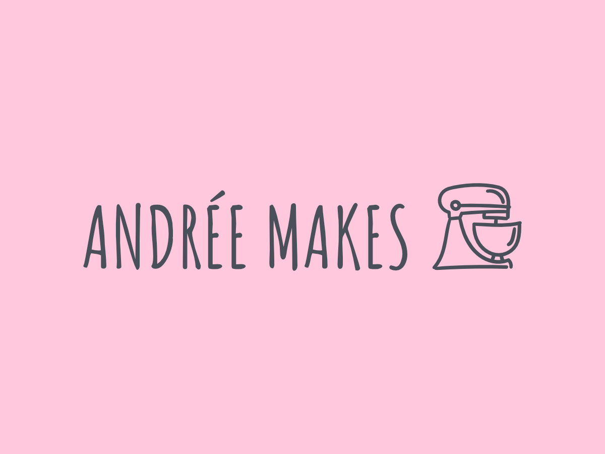

# Andrée Makes Block Theme



## What is this?

This is the block theme for [andreemakes.com](https://andreemakes.com). This theme was created using [itsamoreh/block-theme-starter](https://github.com/itsamoreh/block-theme-starter).

## Local Environment

This theme includes a `.wp-env.json`. To spin up a WordPress environment with `wp-env` first make sure docker desktop is installed.
Then run the following command to start the environment:

```bash
npm run start
```

You can stop the environment with the stop command:

```bash
npm run stop
```

See the [wp-env documentation](https://developer.wordpress.org/block-editor/reference-guides/packages/packages-env/#installation) for more details.

## Building and Watching CSS

To build the CSS using PostCSS, run the following command in your terminal:

```bash
npm run build:css
```

This will take the assets/main.css file, run it and all imports through PostCSS, and output the result to style.css.
To watch for changes to your CSS and automatically rebuild, run the following command in your terminal:

```bash
npm run watch:css
```

This will start PostCSS in watch mode, which will watch for changes to your assets/main.css file.
Whenever you save a change to the CSS, PostCSS will automatically rebuild and output the result to style.css.

## Building and Watching Custom Blocks

```bash
npm run watch:blocks
```

This will use wp-scripts to watch for changes to your blocks inside `blocks/` and automatically rebuild them when necessary.
The blocks are output to the `blocks-built/` directory. Make sure to enqueue the built blocks in the theme.

## Theme Documentation

This is where you can place documentation for the theme.

Markdown files in the `editors` directory will be parsed and displayed in the
admin panel. This is a great place to explain how to use your theme, what
features it has, and any other information that might be useful to the
WordPress users. Place images in the `images` directory and link to them in the
markdown files. Use relative links.

Markdown files in the `developers` directory will be parsed and displayed in
the admin panel for administrators only. This is a great place to write
documentation for yourself in the future or any other developers that might
work on the theme. Place images in the `images` directory and link to them in the
markdown files. Use relative links.

_Note_: You need to keep the table of contents in `developers/_index.md` and
`editors/_index.md` up to date manually.
